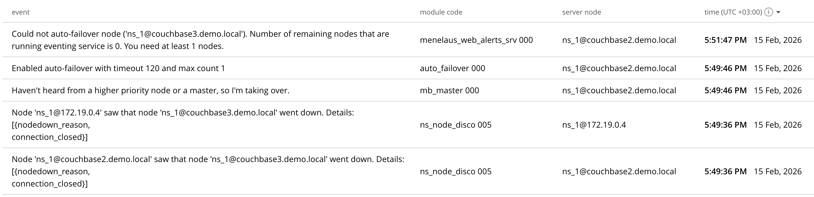
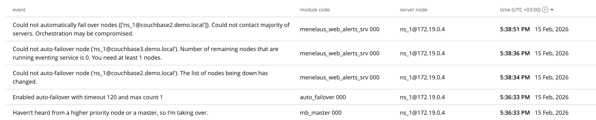

# Домашнее задание

### Кластер Couchbase

### Цель:
В результате выполнения ДЗ вы построение отказоустойчивый кластер Couchbase.


### Описание/Пошаговая инструкция выполнения домашнего задания:
- Развернуть кластер Couchbase
- Создать БД, наполнить небольшими тестовыми данными
- Проверить отказоустойчивость


### Критерии оценки:

- Задание выполнено - 10 баллов
- Предложено красивое решение - плюс 2 балла
- Минимальный порог: 10 баллов


# Отчет

Запуск контейнеров с couchbase производится через docker-compose [файл](../couchbase/docker-compose.yaml).

Настройка кластера, ролей инстансов и ребалансинг производится через [скрипт](../couchbase/init_cluster.sh)

```sh
sh init_cluster.sh
```

Далее либо через [скрипт](../couchbase/import_data.sh), либо вручную создаем структуру бд и импортируем данные.

Создаем bucket
```sh
docker exec couchbase1 couchbase-cli bucket-create \
    --cluster couchbase1 \
    --username admin \
    --password password \
    --bucket meflix \
    --bucket-type couchbase \
    --bucket-ramsize 256 \
    --bucket-replica 1 \
    --num-vbuckets 128
```

Создаем scope
```sh
docker exec couchbase1 couchbase-cli collection-manage \
    --cluster couchbase1 \
    --username admin \
    --password password \
    --bucket meflix \
    --create-scope public
```

Создаем коллекцию
```sh
docker exec couchbase1 couchbase-cli collection-manage \
    --cluster couchbase1 \
    --username admin \
    --password password \
    --bucket meflix \
    --create-collection public.users
```

Импортируем документы в коллекцию
```sh
docker exec couchbase1 cbimport json \
    --cluster couchbase1 \
    --dataset file:///users.json --format list \
    --username admin \
    --password password \
    --bucket meflix \
    --scope-collection-exp public.users \
    --generate-key %id%
```

### Отказоустойчивость

В нашем кластере
- couchbase1 отвечает за data, index, query
- couchbase2 отвечает за data, index
- couchbase3 отвечает за fts, eventing, analytics

Для проверки работоспособности кластера будем выполнять следующий запрос

```sql
select *
from meflix.`public`.users
where id=1;
```

Тушим контейнер с сервисами аналитики и эвентов couchbase3.

Запрос продолжает выполняться, но судя по логам сервис Eventing стал нерабочим из-за того, что больше нет нод, которые могли бы подхватить эту роль


Возвращаем контейнер couchbase3 и тушим couchbase2.

Автоматически происходит failover. Подключется реплика на couchbase1 и все данные теперь берутся с couchbase1. Запрос продолжает выполняться, но получаем уведомление, что репликация более не работает, так как необходимо как минимум 2 сервиса работоспособных data для репликации.

Возвращаем контейнер couchbase2. Кластер просит провести ребалансировку.
```sh
docker exec couchbase1 couchbase-cli rebalance
    -c couchbase1 \
    -u admin \
    -p password
```

Теперь потушим контейнеры couchbase2 из couchbase3 и сделаем запрос.

После таймаута получаем такой ответ на запрос и такие логи

```json
[
  {
    "code": 16062,
    "msg": "Scan failed",
    "reason": {
      "_level": "exception",
      "caller": "memcached_scan:2220",
      "cause": "dial tcp: lookup couchbase2.demo.local on 127.0.0.11:53: server misbehaving",
      "code": 16059,
      "key": "datastore.seq_scan.get_connection",
      "message": "Failed to get connection for scan"
    }
  }
]
```


Кворум не смог собраться и кластер стал нерабочим
