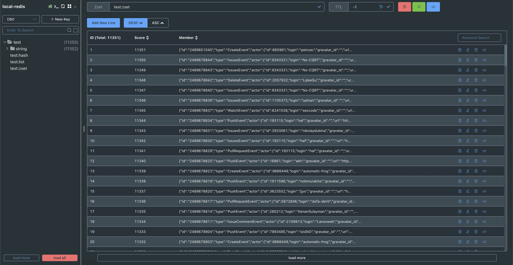

# Домашнее задание

## Redis

### Цель:
В результате выполнения ДЗ вы поработаете с Redis.


### Описание/Пошаговая инструкция выполнения домашнего задания:
Необходимо:
- Сохранить большой жсон (~20МБ) в виде разных структур - строка, hset, zset, list;
- Протестировать скорость сохранения и чтения;
- Предоставить отчет.
- Задание повышенной сложности*
настроить редис кластер на 3х нодах с отказоусточивостью, затюнить таймоуты


### Критерии оценки:

- Задание выполнено - 10 баллов
- Предложено красивое решение - плюс 2 балла
- Выполнено задание со* - плюс 5 баллов
- Минимальный порог: 10 баллов


# Отчет

Редис развернут локально на машине.

Json с 20 МБ тестовых данных находится в файле [large-file.json](../redis/data/large-file.json)

Для выполнения задания запускаем скрипт [benchmark.sh](../redis/benchmark.sh)

```sh
sh benchmark.sh
```

В нем происходит:
- наполнение данными из [large-file.json](../redis/data/large-file.json) для типов данных STRING, HSET, ZSET, LIST
- вставка элемента в каждый разновидность типа данных
- чтение этого элемента
- вывод времени выполнения для записи и чтения

Результат выполнения скрипта

```
Количество элементов в тестовом файле: 11351

Очищаем базу данных...
OK

Заполняем STRING...
Готово
Вставляем новый и читаем новый элемент...
STRING: запись 0.010 сек, чтение 0.008 сек

Заполняем LIST...
Готово
Вставляем новый и читаем новый элемент...
LIST: запись 0.007 сек, чтение 0.008 сек

Заполняем HASH...
Готово
Вставляем новый и читаем новый элемент...
HASH: запись 0.008 сек, чтение 0.007 сек

Заполняем ZSET...
Готово
Вставляем новый и читаем новый элемент...
ZSET: запись 0.012 сек, чтение 0.013 сек
```

Проверяем, что скрипт отработал корректно и весь объем данных вставился

