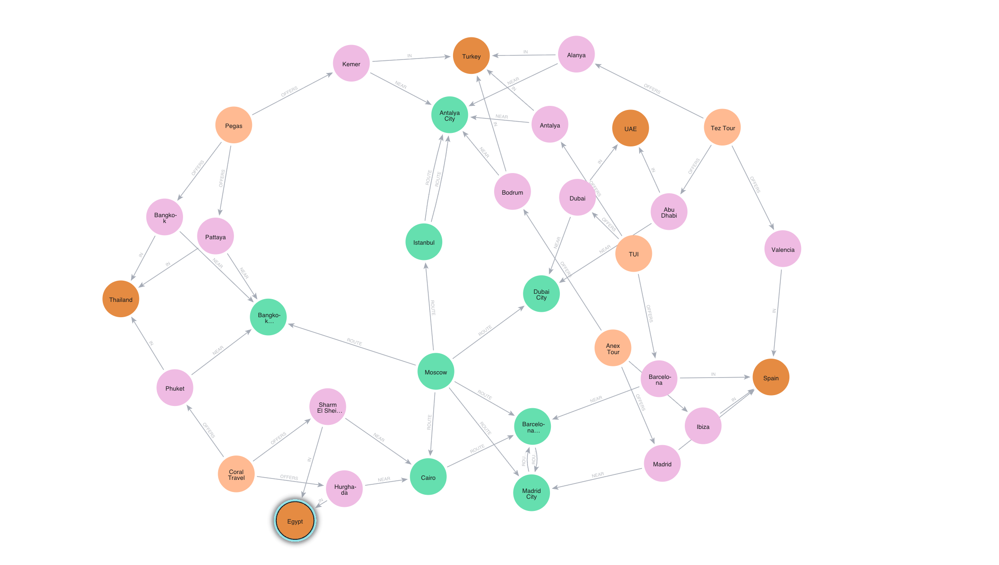
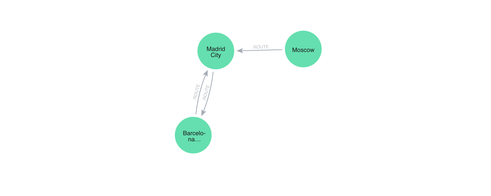
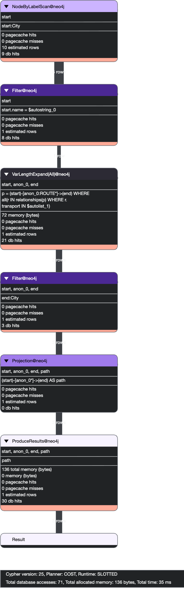
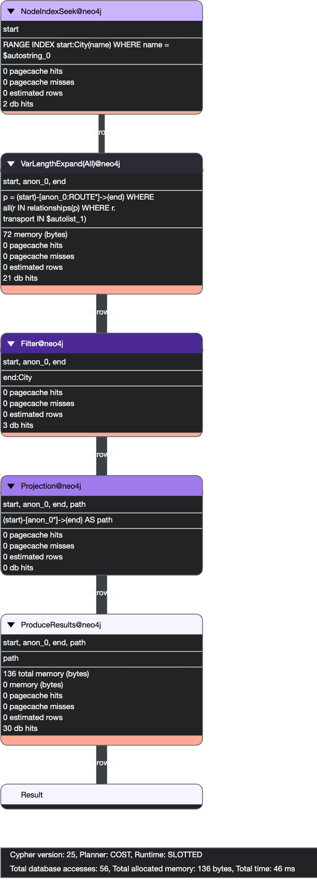

# Домашнее задание

## Использование neo4j

### Цель:
- Научиться представлять данные в neo4j
- Научиться использовать Cypher для манипуляции данными в neo4j
- Научиться смотреть план запроса
- Создание индексов

### Описание/Пошаговая инструкция выполнения домашнего задания:
- Взять 4-5 популярных туроператора.
- Каждый туроператор должен быть представлен в виде ноды neo4j
- Взять 10-15 направлений, в которые данные операторы предоставляют путевки.
- Представить направления в виде связки нод: страна - конкретное место
- Взять ближайшие к туристическим локациям города, в которых есть аэропорты или вокзалы и представить их в виде нод
- Представить маршруты между городами в виде связей. Каждый маршрут должен быть охарактеризован видом транспорта, который позволяет переместиться между точками.
- Написать запрос, который бы выводил направление (со всеми промежуточными точками), который можно осуществить только наземным транспортом.
- Составить план запроса из пункта 7.
- Добавить индексы для оптимизации запроса
- Еще раз посмотреть план запроса и убедиться, что индексы позволили оптимизировать запрос

### Критерии оценки:

- Задание выполнено - 10 баллов
- Предложено красивое решение - плюс 2 балла


# Отчет

Neo4j развернут в контейнере через файл [docker-compose](../neo4j/docker-compose.yaml)

Ноды:
`TourOperator` — туроператоры
`Country` — страны
`Location` — курорты/места
`City` — города (с аэропортами/вокзалами)

Связи:
`(TourOperator)-[:OFFERS]->(Location)`
`(Location)-[:IN]->(Country)`
`(Location)-[:NEAR]->(City)`
`(City)-[:ROUTE {transport: "..."}]->(City)`


## Создание данных


Ноды

```cypher
CREATE
// Туроператоры
(tui:TourOperator {name: 'TUI'}),
(coral:TourOperator {name: 'Coral Travel'}),
(pegas:TourOperator {name: 'Pegas'}),
(anex:TourOperator {name: 'Anex Tour'}),
(tez:TourOperator {name: 'Tez Tour'}),

// Страны
(turkey:Country {name: 'Turkey'}),
(egypt:Country {name: 'Egypt'}),
(spain:Country {name: 'Spain'}),
(uae:Country {name: 'UAE'}),
(thailand:Country {name: 'Thailand'}),

// Локации (15)
(antalya:Location {name: 'Antalya'}),
(alanya:Location {name: 'Alanya'}),
(kemer:Location {name: 'Kemer'}),
(bodrum:Location {name: 'Bodrum'}),
(sharm:Location {name: 'Sharm El Sheikh'}),
(hurghada:Location {name: 'Hurghada'}),
(barcelona_loc:Location {name: 'Barcelona'}),
(madrid_loc:Location {name: 'Madrid'}),
(dubai_loc:Location {name: 'Dubai'}),
(abudhabi:Location {name: 'Abu Dhabi'}),
(phuket:Location {name: 'Phuket'}),
(pattaya:Location {name: 'Pattaya'}),
(bangkok_loc:Location {name: 'Bangkok'}),
(ibiza:Location {name: 'Ibiza'}),
(valencia:Location {name: 'Valencia'}),

// Города (транспортные узлы)
(moscow:City {name: 'Moscow'}),
(istanbul:City {name: 'Istanbul'}),
(antalya_city:City {name: 'Antalya City'}),
(cairo:City {name: 'Cairo'}),
(barcelona:City {name: 'Barcelona City'}),
(madrid:City {name: 'Madrid City'}),
(dubai:City {name: 'Dubai City'}),
(bangkok:City {name: 'Bangkok City'});
```

Страна → локация

```cypher
MATCH
(turkey:Country {name:'Turkey'}),
(egypt:Country {name:'Egypt'}),
(spain:Country {name:'Spain'}),
(uae:Country {name:'UAE'}),
(thailand:Country {name:'Thailand'}),

(antalya:Location {name:'Antalya'}),
(alanya:Location {name:'Alanya'}),
(kemer:Location {name:'Kemer'}),
(bodrum:Location {name:'Bodrum'}),
(sharm:Location {name:'Sharm El Sheikh'}),
(hurghada:Location {name:'Hurghada'}),
(barcelona_loc:Location {name:'Barcelona'}),
(madrid_loc:Location {name:'Madrid'}),
(dubai_loc:Location {name:'Dubai'}),
(abudhabi:Location {name:'Abu Dhabi'}),
(phuket:Location {name:'Phuket'}),
(pattaya:Location {name:'Pattaya'}),
(bangkok_loc:Location {name:'Bangkok'}),
(ibiza:Location {name:'Ibiza'}),
(valencia:Location {name:'Valencia'})

CREATE
(antalya)-[:IN]->(turkey),
(alanya)-[:IN]->(turkey),
(kemer)-[:IN]->(turkey),
(bodrum)-[:IN]->(turkey),

(sharm)-[:IN]->(egypt),
(hurghada)-[:IN]->(egypt),

(barcelona_loc)-[:IN]->(spain),
(madrid_loc)-[:IN]->(spain),
(ibiza)-[:IN]->(spain),
(valencia)-[:IN]->(spain),

(dubai_loc)-[:IN]->(uae),
(abudhabi)-[:IN]->(uae),

(phuket)-[:IN]->(thailand),
(pattaya)-[:IN]->(thailand),
(bangkok_loc)-[:IN]->(thailand);
```

Туроператоры → направления

```cypher
MATCH (t:TourOperator), (l:Location)
WHERE
(t.name = 'TUI' AND l.name IN ['Antalya','Barcelona','Dubai']) OR
(t.name = 'Coral Travel' AND l.name IN ['Hurghada','Sharm El Sheikh','Phuket']) OR
(t.name = 'Pegas' AND l.name IN ['Kemer','Pattaya','Bangkok']) OR
(t.name = 'Anex Tour' AND l.name IN ['Bodrum','Madrid','Ibiza']) OR
(t.name = 'Tez Tour' AND l.name IN ['Alanya','Valencia','Abu Dhabi'])
CREATE (t)-[:OFFERS]->(l);
```

Локация → ближайший город

```cypher
MATCH
(antalya:Location {name:'Antalya'}), (antalya_city:City {name:'Antalya City'}),
(alanya:Location {name:'Alanya'}),
(kemer:Location {name:'Kemer'}),
(bodrum:Location {name:'Bodrum'}),

(sharm:Location {name:'Sharm El Sheikh'}), (cairo:City {name:'Cairo'}),
(hurghada:Location {name:'Hurghada'}),

(barcelona_loc:Location {name:'Barcelona'}), (barcelona:City {name:'Barcelona City'}),
(madrid_loc:Location {name:'Madrid'}), (madrid:City {name:'Madrid City'}),

(dubai_loc:Location {name:'Dubai'}), (dubai:City {name:'Dubai City'}),
(abudhabi:Location {name:'Abu Dhabi'}),

(phuket:Location {name:'Phuket'}), (bangkok:City {name:'Bangkok City'}),
(pattaya:Location {name:'Pattaya'}),
(bangkok_loc:Location {name:'Bangkok'})

CREATE
(antalya)-[:NEAR]->(antalya_city),
(alanya)-[:NEAR]->(antalya_city),
(kemer)-[:NEAR]->(antalya_city),
(bodrum)-[:NEAR]->(antalya_city),

(sharm)-[:NEAR]->(cairo),
(hurghada)-[:NEAR]->(cairo),

(barcelona_loc)-[:NEAR]->(barcelona),
(madrid_loc)-[:NEAR]->(madrid),

(dubai_loc)-[:NEAR]->(dubai),
(abudhabi)-[:NEAR]->(dubai),

(phuket)-[:NEAR]->(bangkok),
(pattaya)-[:NEAR]->(bangkok),
(bangkok_loc)-[:NEAR]->(bangkok);
```

Маршруты

```cypher
MATCH
(moscow:City {name:'Moscow'}),
(istanbul:City {name:'Istanbul'}),
(antalya_city:City {name:'Antalya City'}),
(cairo:City {name:'Cairo'}),
(barcelona:City {name:'Barcelona City'}),
(madrid:City {name:'Madrid City'}),
(dubai:City {name:'Dubai City'}),
(bangkok:City {name:'Bangkok City'})

CREATE
// перелёты
(moscow)-[:ROUTE {transport:'plane'}]->(istanbul),
(moscow)-[:ROUTE {transport:'plane'}]->(cairo),
(moscow)-[:ROUTE {transport:'plane'}]->(dubai),
(moscow)-[:ROUTE {transport:'plane'}]->(bangkok),
(moscow)-[:ROUTE {transport:'plane'}]->(barcelona),

// наземные
(istanbul)-[:ROUTE {transport:'bus'}]->(antalya_city),
(istanbul)-[:ROUTE {transport:'train'}]->(antalya_city),
(cairo)-[:ROUTE {transport:'bus'}]->(barcelona),
(barcelona)-[:ROUTE {transport:'train'}]->(madrid),
(madrid)-[:ROUTE {transport:'train'}]->(barcelona),
(moscow)-[:ROUTE {transport:'train'}]->(madrid);
```

Результат



## Запрос маршрутов наземного транспорта

```cypher
MATCH (start:City {name:'Moscow'})
MATCH path = (start)-[:ROUTE*]->(end:City)
WHERE ALL(r IN relationships(path) WHERE r.transport IN ['bus','train','car'])
RETURN path;
```

Результат




Query plan

```cypher
PROFILE
MATCH (start:City {name:'Moscow'})
MATCH path = (start)-[:ROUTE*]->(end:City)
WHERE ALL(r IN relationships(path) WHERE r.transport IN ['bus','train','car'])
RETURN path;
```

Результат



Создаем индексы

```cypher
CREATE INDEX city_name_index FOR (c:City) ON (c.name);
CREATE INDEX location_name_index FOR (l:Location) ON (l.name);
CREATE INDEX operator_name_index FOR (t:TourOperator) ON (t.name);
```

План запроса после этого


