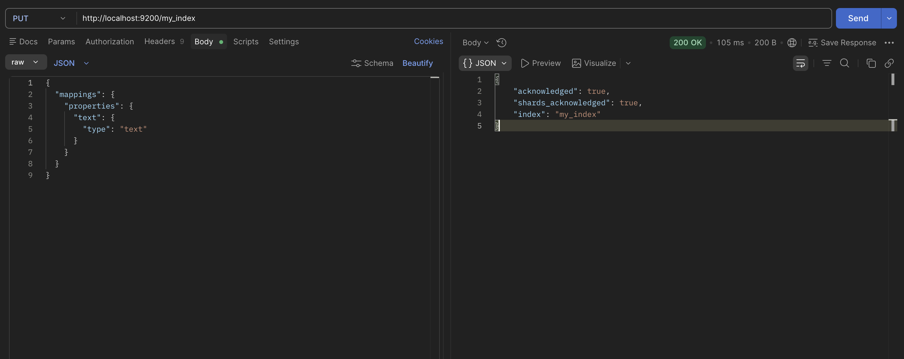
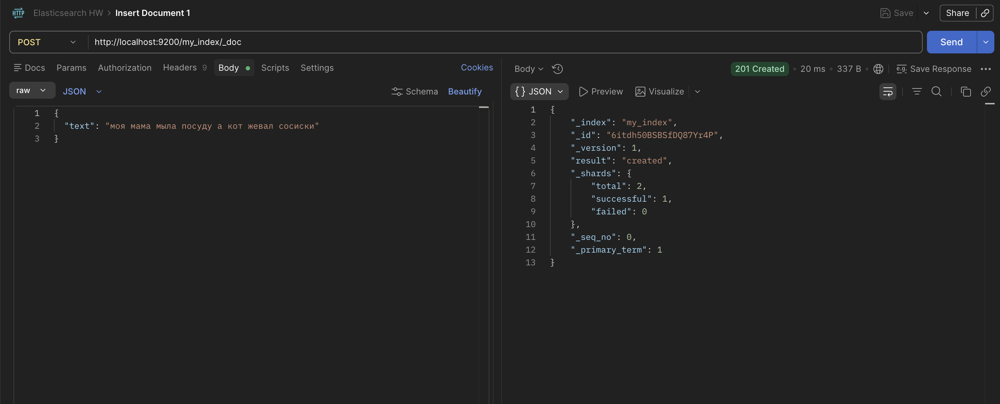
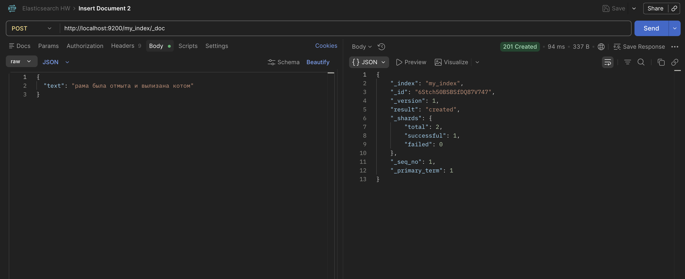
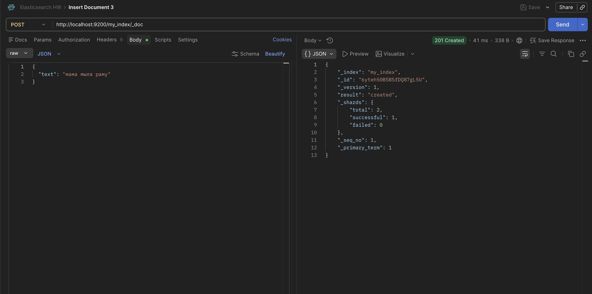
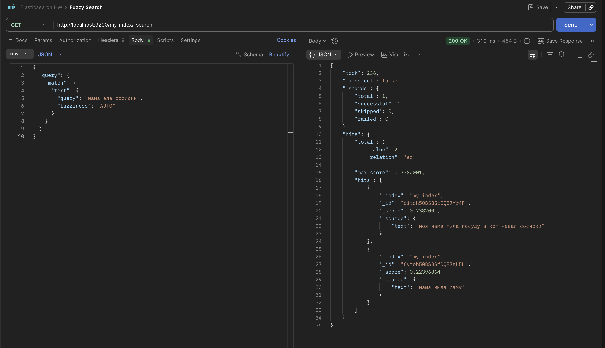

# Домашнее задание

## Знакомство с ElasticSearch

### Цель:
В результате выполнения ДЗ вы научитесь разворачивать ES в AWS и использовать полнотекстовый нечеткий поиск

### Описание/Пошаговая инструкция выполнения домашнего задания:
- Развернуть Instance ES – желательно в AWS
- Создать в ES индекс, в нём должно быть обязательное поле text типа string
- Создать для индекса pattern
- Добавить в индекс как минимум 3 документа желательно со следующим содержанием:
«моя мама мыла посуду а кот жевал сосиски»
«рама была отмыта и вылизана котом»
«мама мыла раму»
- Написать запрос нечеткого поиска к этой коллекции документов ко ключу «мама ела сосиски»
- Расшарить коллекцию postman (желательно сдавать в таком формате)
- Прислать ссылку на коллекцию

### Критерии оценки:
- Задание выполнено - 10 баллов
- Предложено красивое решение - плюс 2 балла

## Отчет

ElasticSearch развернут в контейнере через файл [docker-compose](../elasticsearch/docker-compose.yaml)

При попытке пошарить коллекцию Postman предлагает купить подписку, поэтому результат прикладываю в виде скриншотов.

Создание индекса с обязательным полем text 

Создание документов

Запрос нечеткого поиска к этой коллекции документов ко ключу «мама ела сосиски»

