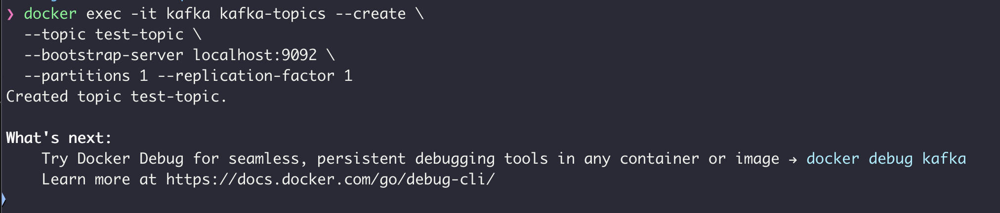
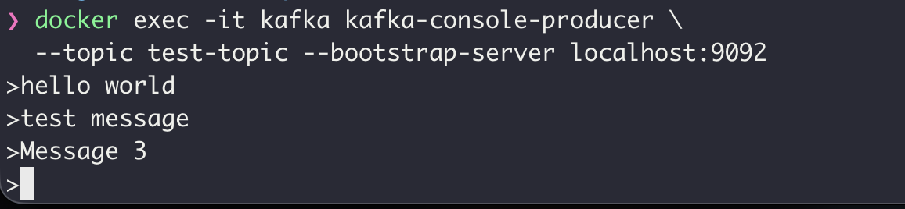
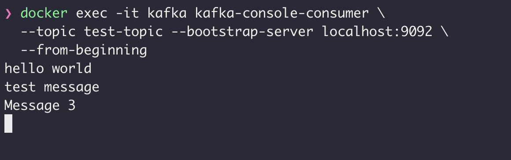
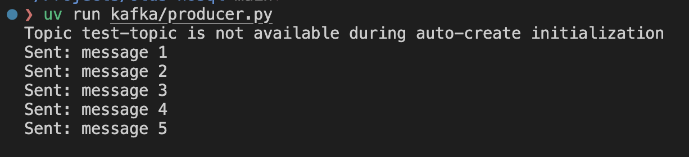
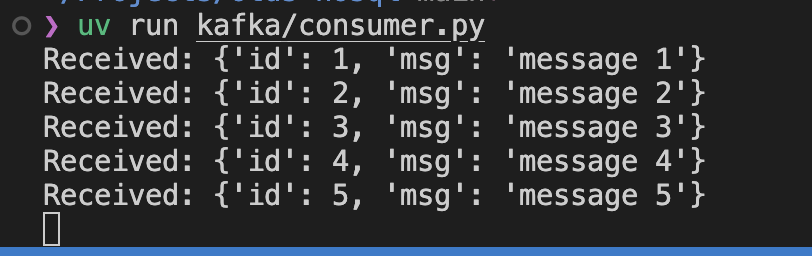

# Домашнее задание

## Kafka

### Цель:
Научится запускать Kafka, работать с ее утилитами;

### Описание/Пошаговая инструкция выполнения домашнего задания:
- Запустите Kafka (можно в docker)
- Отправьте несколько сообщений используя утилиту kafka-producer
- Прочитайте их, используя графический интерфейс или утилиту kafka-consumer
- Отправьте и прочитайте сообщения программно - выберите знакомый язык программирования (C#, Java, Python или любой другой, для которого есть библиотека для работы с Kafka), отправьте и прочитайте несколько сообщений

Для пунктов 2 и 3 сделайте скриншоты отправки и получения сообщений.
Для пункта 4 приложите ссылку на репозитарий на гитхабе с исходным кодом.

## Отчет

Kafka развернута в контейнере через файл [docker-compose](../kafka/docker-compose.yaml)

Создаем тестовый топик

Отправляем тестовые сообщения

Читаем тестовые сообщения

### Реализация на Python

Реализация producer в файле [producer.py](../kafka/producer.py)

Реализация consumer в файлк [consumer.py](../kafka/consumer.py)

