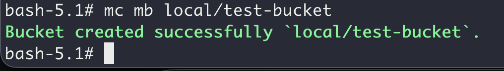
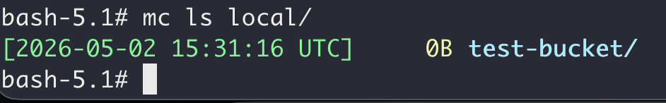
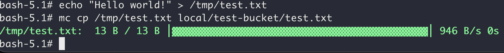
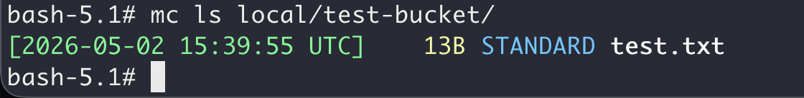
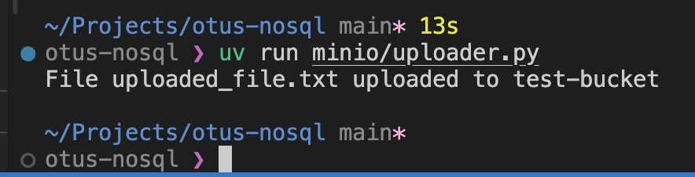
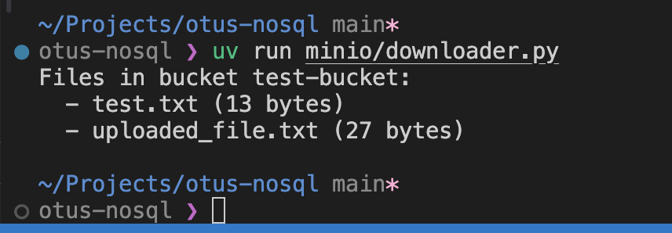

# Домашнее задание

## Запустить сервис S3

### Цель:
научиться работать с S3 подобными сервисами;


### Описание/Пошаговая инструкция выполнения домашнего задания:
- Запустить сервис S3 в облаке или локально (Docker + minio)
- Создать бакет используя API
- Сохранить файл в бакет используя API
- Сохраните файл программно - выберите знакомый язык программирования (C#, Java, Go, Python или любой другой, для которого есть библиотека для работы с S3), отправьте файл в бакет и потом получите массив файлов из бакета и отобразите в браузере или консоли.
- Для пунктов 2 и 3 сделайте скриншоты результата выполнения.
- Для пункта 4 приложите ссылку на репозитарий на гитхабе с исходным кодом.


# Отчет

MinIO запускается через docker-compose [файл](../minio/docker-compose.yaml).


Подключаемся к контейнеру:
```sh
docker exec -it minio bash
```

Настройка mc (minio client) для работы с локальным сервером:
```sh
mc alias set local http://localhost:9000 minioadmin minioadmin
```


Создаем бакет:
```sh
mc mb local/test-bucket
```



Проверим список бакетов:
```sh
mc ls local/
```




Создаем тестовый файл и загружаем в бакет:
```sh
echo "Hello world!" > /tmp/test.txt
```
```sh
mc cp /tmp/test.txt local/test-bucket/test.txt
```



Проверим содержимое бакета:
```sh
mc ls local/test-bucket/
```




### Реализация на Python

Реализация uploader в файле [uploader.py](../minio/uploader.py)



Реализация downloader в файле [lister.py](../minio/downloader.py)



