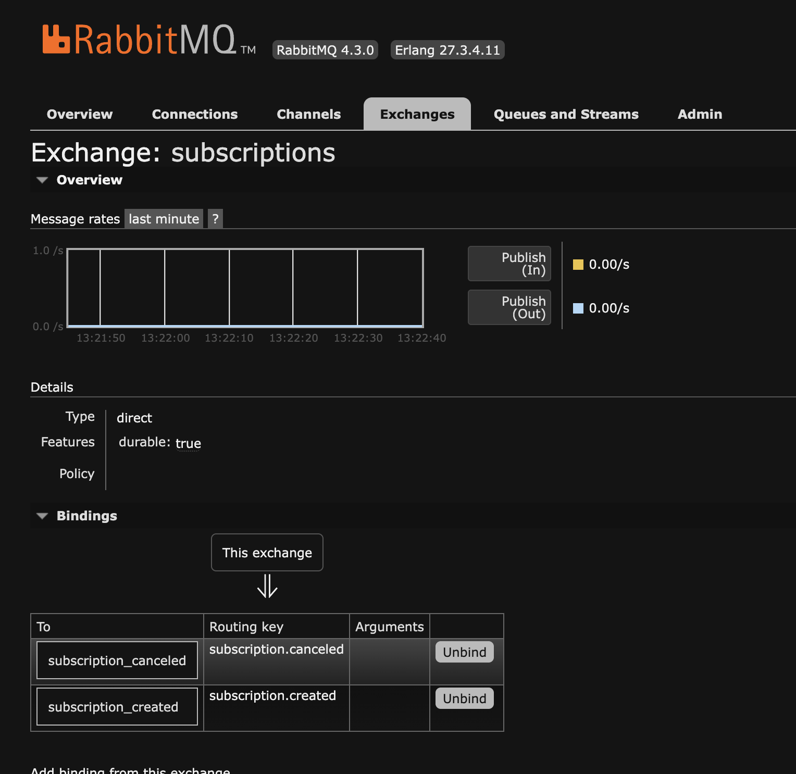
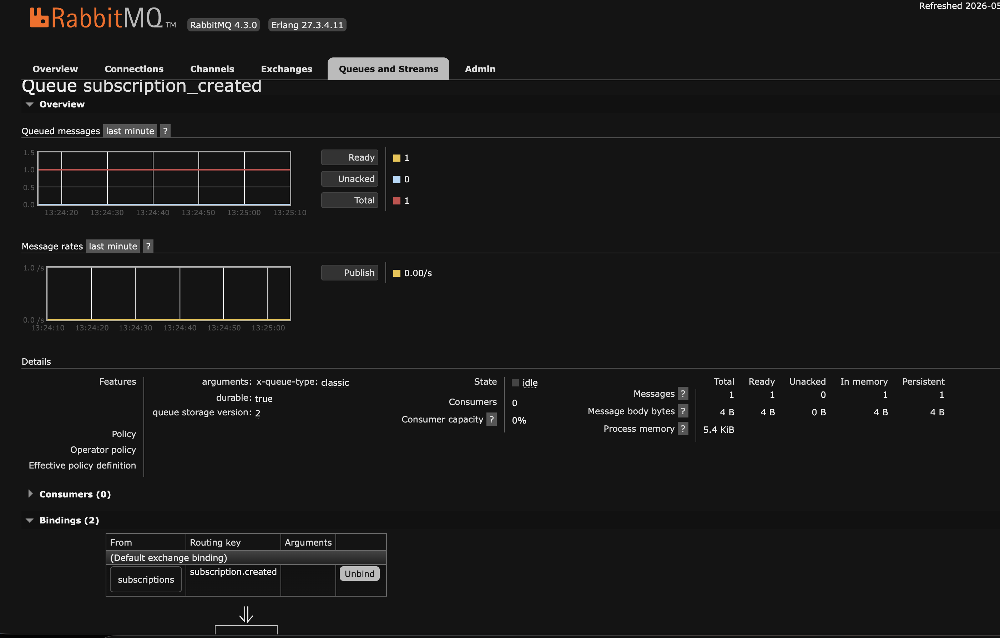
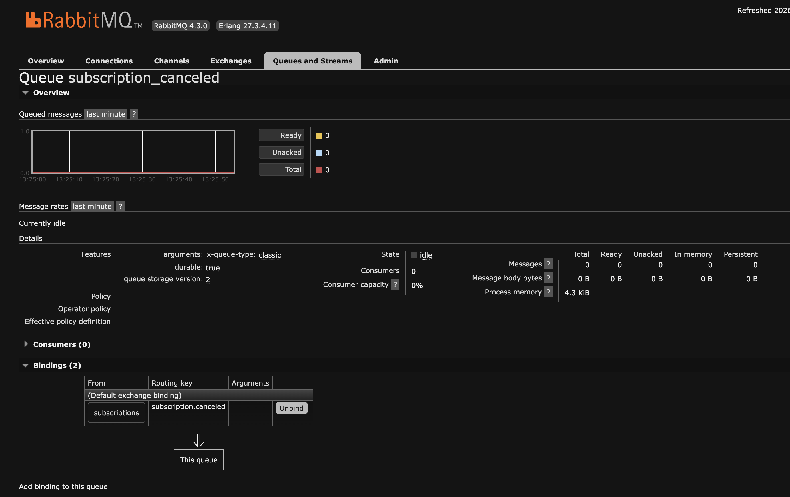
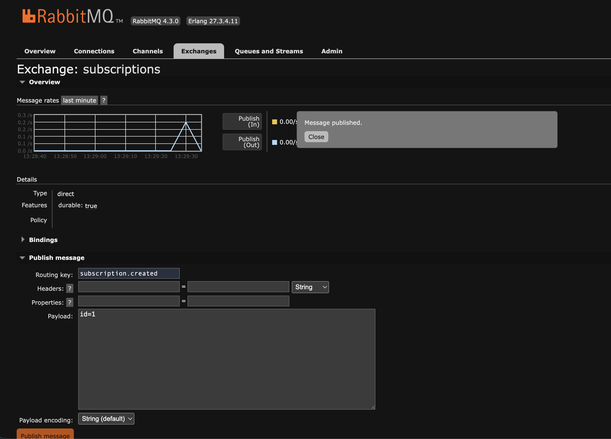
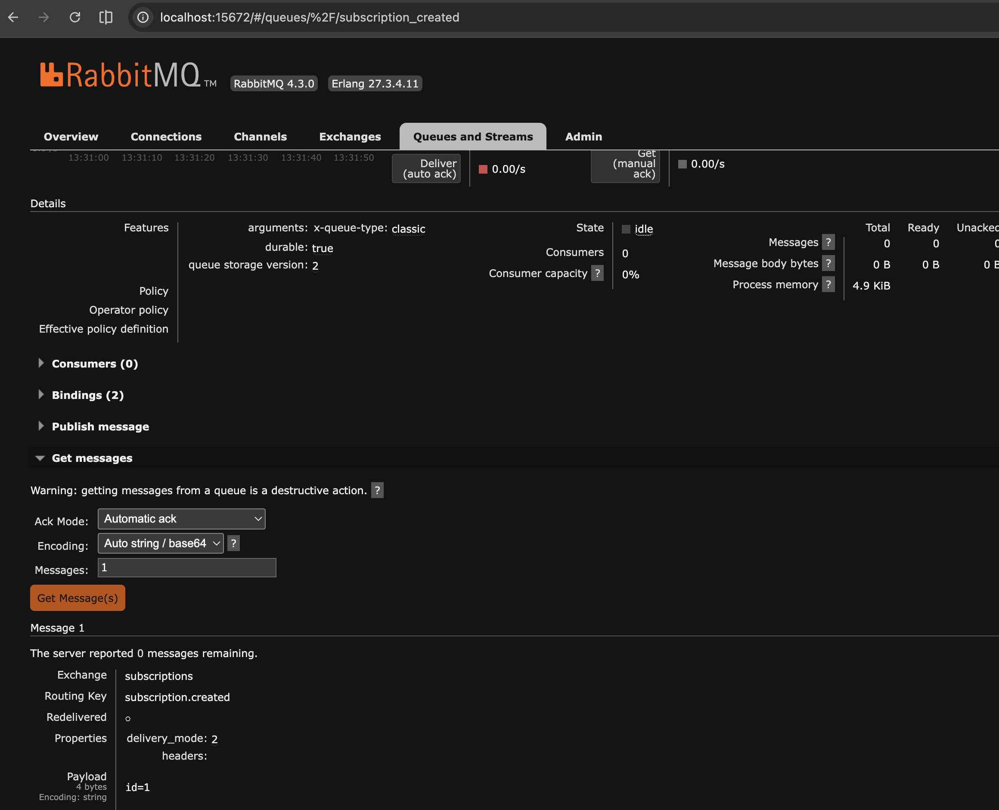
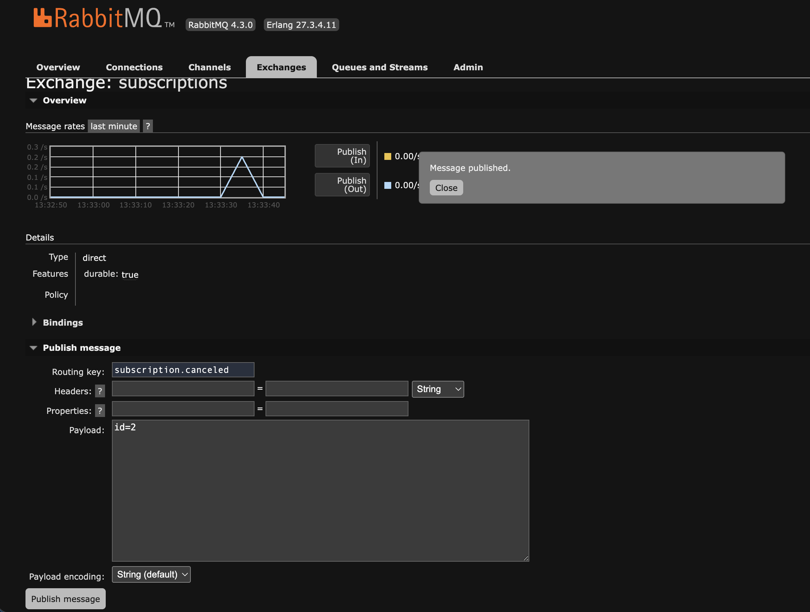
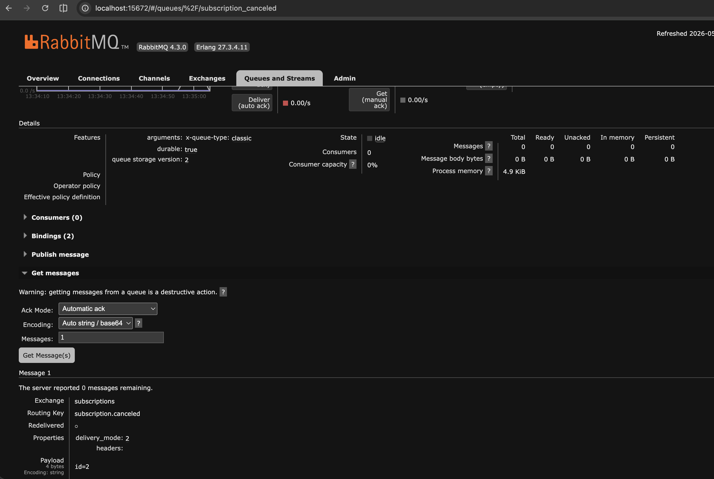
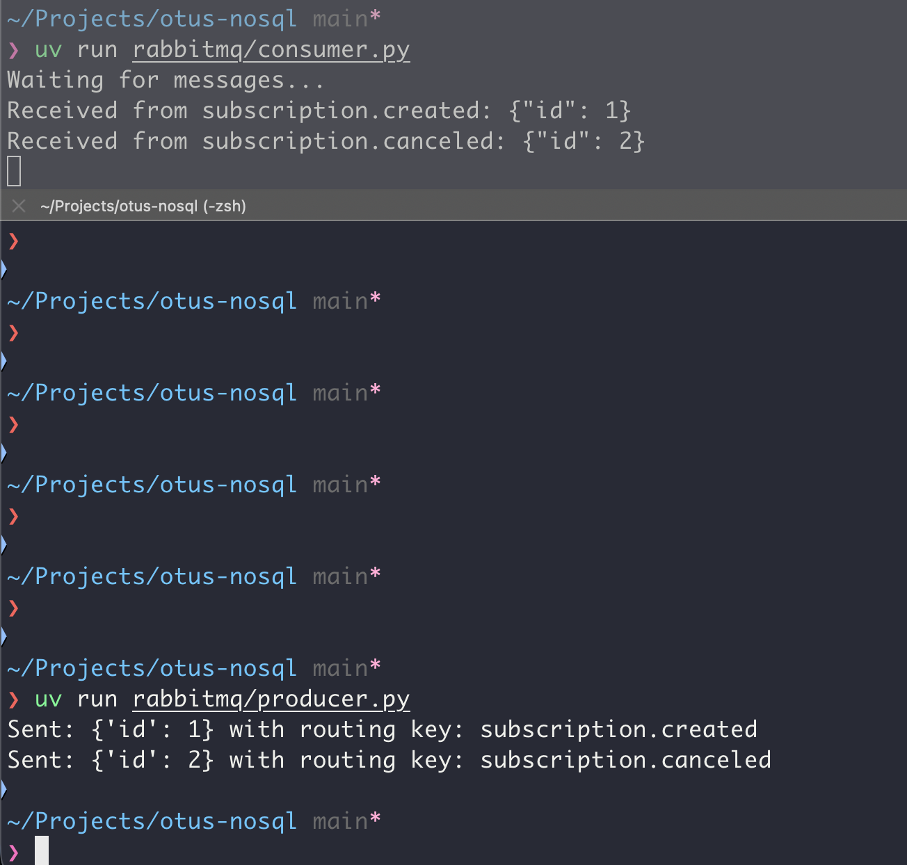

# Домашнее задание

## Работаем с RabbitMQ

### Цель:
Научиться запускать RabbitMQ, работать через UI в браузере и с использованием программного кода


### Описание/Пошаговая инструкция выполнения домашнего задания:
- Запустите RabbitMQ (можно в docker)
- Отправьте несколько тем для сообщений через web UI
- Прочитайте их, используя web UI в браузере
- Отправьте и прочитайте сообщения программно - выберите знакомый язык программирования (C#, Java, Go, Python или любой другой, для которого есть библиотека для работы с RabbitMQ), отправьте и прочитайте несколько сообщений


# Отчет

Запуск производится через docker-compose [файл](../rabbitmq/docker-compose.yaml).

```sh
docker-compose -f rabbitmq/docker-compose.yaml up -d
```

### WebUI

Для теста создадим exchange по подпискам, который будет отправлять сообщения в две очереди - создания подписки и отмены подписки.







Отправим сообщения и проверим, что они попадают в нужные queue

Создание подписки





Отмена подписки





Все корректно работает


### Реализация на Python

Реализация producer в файле [producer.py](../rabbitmq/producer.py)


Реализация consumer в файлк [consumer.py](../rabbitmq/consumer.py)

