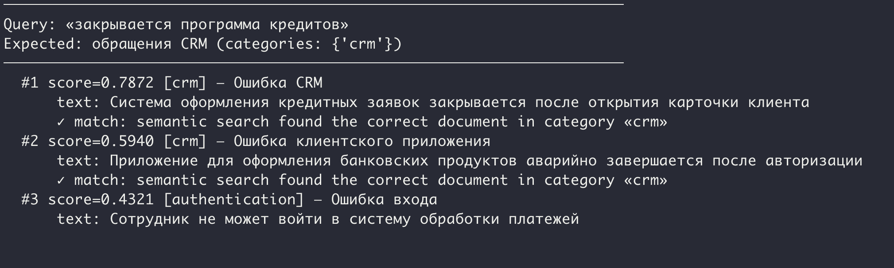
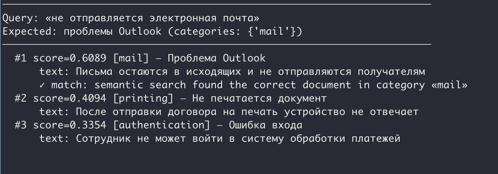
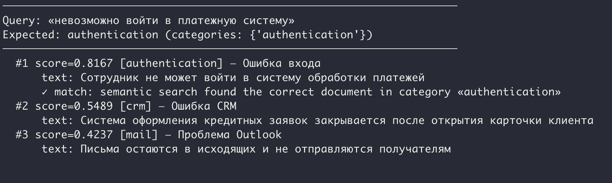
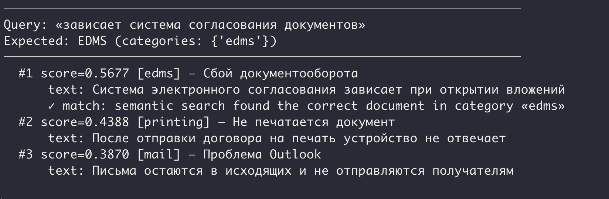

# Домашнее задание

## Qdrant и векторные базы данных

### Цель:
Настроить векторный поиск в Qdrant для извлечения семантически связанных обращений банковской техподдержки по смыслу запроса.


### Описание/Пошаговая инструкция выполнения домашнего задания:
В крупном банке работает внутренняя служба технической поддержки сотрудников.

Каждый день сотрудники банка создают обращения:
- проблемы с доступом к корпоративным системам;
- ошибки при работе с CRM;
- сбои электронной почты;
- проблемы с электронным документооборотом;
- ошибки печати документов;
- проблемы с бухгалтерскими приложениями;
- ошибки авторизации;
- зависания рабочих приложений.

За несколько лет в системе накопились тысячи обращений.
Сейчас поиск работает только по ключевым словам.

Например:

Сотрудник вводит запрос:
«не открывается клиент для работы с договорами».

Но нужное обращение содержит текст:
«после обновления система оформления кредитных заявок завершается с ошибкой»
Из-за различия формулировок обычный поиск часто не находит нужные записи.


#### Задача:

Разработать прототип системы семантического поиска на основе Qdrant.
Система должна находить похожие обращения не по совпадению слов, а по смыслу текста.

#### Исходные данные
Необходимо создать коллекцию обращений сотрудников банка.

Каждое обращение содержит:
- Поле Описание
- id идентификатор
- title краткое название
- text описание проблемы
- department подразделение
- category тип проблемы

#### Тестовые данные

Необходимо загрузить в систему следующие обращения.

Обращение 1

```json
{
    "id": 1,
    "title": "Ошибка CRM",
    "text": "Система оформления кредитных заявок закрывается после открытия карточки клиента",
    "department": "credit",
    "category": "crm"
}
```


Обращение 2

```json
{
    "id": 2,
    "title": "Не печатается документ",
    "text": "После отправки договора на печать устройство не отвечает",
    "department": "operations",
    "category": "printing"
}
```


Обращение 3

```json
{
    "id": 3,
    "title": "Ошибка входа",
    "text": "Сотрудник не может войти в систему обработки платежей",
    "department": "finance",
    "category": "authentication"
}
```


Обращение 4

```json
{
    "id": 4,
    "title": "Проблема Outlook",
    "text": "Письма остаются в исходящих и не отправляются получателям",
    "department": "office",
    "category": "mail"
}
```


Обращение 5

```json
{
    "id": 5,
    "title": "Сбой документооборота",
    "text": "Система электронного согласования зависает при открытии вложений",
    "department": "legal",
    "category": "edms"
}
```


Обращение 6

```json
{
    "id": 6,
    "title": "Ошибка клиентского приложения",
    "text": "Приложение для оформления банковских продуктов аварийно завершается после авторизации",
    "department": "credit",
    "category": "crm"
}
```


#### Задание

Необходимо:
- Установить Qdrant.
- Создать коллекцию bank_support.
- Настроить Python-клиент.
- Выбрать embedding-модель.
- Построить embeddings для всех обращений.
- Загрузить данные в Qdrant.
- Необходимо выполнить поиск для следующих запросов:

| Запрос пользователя | Ожидаемый результат |
---------------------------------------------------------
| «закрывается программа кредитов» | обращения CRM |  
| «не отправляется электронная почта» | проблемы Outlook |  
| «невозможно войти в платежную систему» | authentication |  
| «зависает система согласования документов» | EDMS |  

#### Для каждого запроса необходимо:

1. Выписать найденные документы.
2. Объяснить:
    - почему семантический поиск нашел нужный документ?
    - какие слова отсутствовали в исходном тексте?
    - почему поиск по ключевым словам отработает хуже?


### Критерии оценки:
- Задание выполнено - 10 баллов
- Минимальный порог: 10 баллов


# Отчет

### Установка Qdrant

Qdrant запускается через [docker-compose](../qdrant/docker-compose.yaml):

```sh
docker compose -f qdrant/docker-compose.yaml up -d
```


### Выбор embedding-модели

Использована модель `sentence-transformers/paraphrase-multilingual-MiniLM-L12-v2`:
- мультиязычная (поддерживает русский)
- 384 измерения вектора
- лёгкая (~120 MB), работает на CPU без GPU/CUDA
- запускается локально через библиотеку `fastembed`, embedding-модель скачивается один раз при первом запуске

### Данные

Загружено 6 обращений банковской техподдержки. [Скрипт](../qdrant/search.py) создаёт коллекцию `bank_support`, векторизует тексты обращений и загружает в Qdrant вместе с полями `id`, `title`, `text`, `department`, `category`. После этого проводит поиск по заданным обращениям.

Запуск:

```sh
uv run python qdrant/search.py
```


### Результаты поиска

#### Запрос 1: «закрывается программа кредитов»

Ожидаемый результат: обращения CRM.



**Почему сработало:** модель уловила семантическую связь «закрывается программа» ↔ «закрывается после открытия», «кредитов» ↔ «кредитных заявок». В исходном тексте нет слов «программа кредитов», но смысл совпал.

**Почему keyword-поиск хуже:** слово «программа» отсутствует в обращении, слово «кредитов» в разных формах — точное совпадение не даст результата.

---

#### Запрос 2: «не отправляется электронная почта»

Ожидаемый результат: проблемы Outlook.



**Почему сработало:** «не отправляется» ↔ «не отправляются получателям», «электронная почта» ↔ «письма». Слов «электронная почта» и «Outlook» нет в тексте, но модель поняла контекст.

**Почему keyword-поиск хуже:** в обращении нет слов «электронная» и «почта», только «письма» и «исходящие» — keyword-поиск пропустил бы документ.

---

#### Запрос 3: «невозможно войти в платежную систему»

Ожидаемый результат: authentication.



**Почему сработало:** «невозможно войти» ↔ «не может войти», «платежную систему» ↔ «систему обработки платежей».

**Почему keyword-поиск хуже:** разные формы глагола (войти/входит), разный порядок слов — потребовались бы сложные регулярки.

---

#### Запрос 4: «зависает система согласования документов»

Ожидаемый результат: EDMS.



**Почему сработало:** «согласования документов» ↔ «электронного согласования», «зависает» ↔ «зависает». 

**Почему keyword-поиск хуже:** слово «документов» в запросе и «вложений» в обращении — разные, точного пересечения почти нет.
